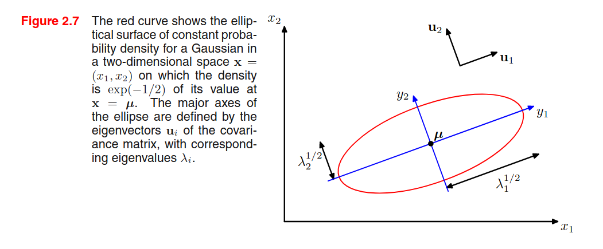
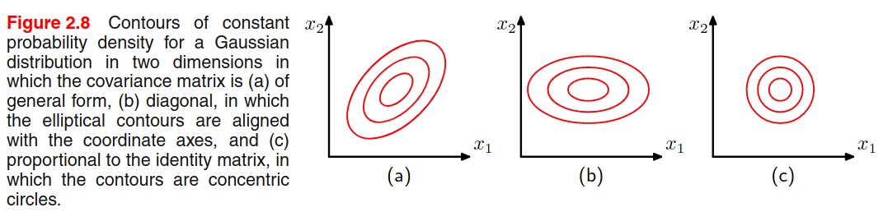

# Probability distributions

This chapter will focus on the problem of density estimation, which consists in finding / estimating the probability distribution $p(x)$ from $N$ independent and identically distributed datapoints $x_1, x_2, \dots, x_N$ drawn from $p(x)$. There are two main ways of doing that: the first way is to use parametric density estimation, where you choose one known parametric distribution (e.g., Gaussian) and try to get the right parameters that fit the data. This method assumes that the parametric distribution we use it's suitable for the data, which is not always the case. Another way of doing that is using non-parametric density estimation techniques (e.g., histograms, nn, kernels).

## Bernoulli experiment

Suppose we have a data set $D = \{x_1, \dots, x_N \}$ of i.i.d. observed values of $x \sim Bern(x \mid \mu)$. We can estimate the $\mu$ parameter from the sample in a frequentist way, by maximizing the likelihood (or the log-likelihood): 

$$
\begin{split}
\ln p(D \mid \mu) &= \ln \prod_{n=1}^N p(x_i \mid \mu) \\
&= \sum_{n=1}^N \ln [ \mu^{x_n} (1-\mu)^{(1 - x_n)} ] \\
&= \sum_{n=1}^N [x_n\ln\mu + (1-x_n)\ln(1-\mu)] \\
\end{split} 
$$

To find $\mu$, let's set the log-likelihood derivative w.r.t. $\mu$ to 0:

$$
\begin{split}
\frac{\partial}{\partial \mu} \ln p(D \mid \mu) &= 0 \\
\sum_{n=1}^N \left(\frac{x_n}{\mu} + \frac{1 - x_n}{1-\mu}\right) &= 0 \\
\sum_{n=1}^N \frac{x_n - \mu}{\mu + \mu^2} &= 0 \\
\end{split} 
$$

Since $\frac{x_n - \mu}{\mu + \mu^2} = 0 \Leftrightarrow x_n = \mu$ then:

$$
\begin{split}
\sum_{n=1}^N x_n - \mu &= 0 \\
\sum_{n=1}^N x_n - \sum_{n=1}^N \mu &= 0 \\
\sum_{n=1}^N x_n &= N \mu \\
\frac1N \sum_{n=1}^N x_n &= \mu
\end{split}
$$

$\mu$ is estimated from the sample mean. In this case, the sample mean is an example of sufficient statistic for the model, i.e. calculating other statistics from the sample will not add more information than that.

## Binomial distribution

Sticking with the coin flips example, the binomial distribution models the probability of obtaining $m$ heads out of $N$ total coin flips:

$$
Bin(m \mid N, \mu) = \binom{N}{m} \mu^m (1 - \mu)^{N - m}
$$

Where $\binom{N}{m}$ represents all the possible ways of obtaining $m$ heads out of $N$ coin flips. The mean and variance of a binomial variabile can be estimated by knowning that for i.i.d events the mean of the sum is the sum of the mean, and the variance of the sum is the sum of the variances. Because $m = x_1 + \dots + x_N$ then:

$$
\mathbb E[m] = N \mu \hspace{1cm}
var[m] = N\mu(1-\mu)
$$

## Beta distribution

Please read the [`estimating_parameters_using_a_bayesian_approach`]([Title](https://github.com/LemuelPuglisi/pattern-recognition-and-machine-learning/blob/main/notebooks/ch2/estimating_parameters_using_a_bayesian_approach.ipynb)) notebook. Some quick notes here:

$$
\beta(\mu) = \frac{\Gamma(a+b)}{\Gamma(a) + \Gamma(b)} \mu^{(a-1)}(1-\mu)^{(b-1)}
$$

and 

$$
\mathbb E[\mu] = \frac{a}{a+b} \hspace{1cm}
var[\mu] = \frac{ab}{(a+b)^2(a+b+1)}
$$

## Multinomial variables

It's a generalization of the Bernoulli distribution where a random variable has $K$ possible values instead of being binary. We can represent the variable as a $K$-dimensional binary vector $x = \langle x_1, x_2, \dots, x_K \rangle$ where only one component can be asserted:

$$
\sum_{k=1}^K x_k = 1
$$

The probability of each component to be asserted is regulated by a probability vector $\mu = \langle \mu_1, \mu_2, \dots, \mu_K \rangle$, so that basically $x_k \sim Bern(\mu_k)$. Since the $\mu$ vector represents a probability distribution, then:

$$
\sum_{k=1}^K \mu_k = 1
$$

The multinomial distribution of $x$ is given by:

$$
p(x \mid \mu) = \prod_{k=1}^K \mu_k^{x_k}
$$

And the expected values is $\mathbb{E}[x \mid \mu] = \mu$. Let's consider a dataset of N independente observations, then the likelihood function is:

$$
p(D \mid \mu) = \prod_{n=1}^N \prod_{k=1}^K \mu_k^{x_{nk}} = 
\prod_{k=1}^K \mu_k^{(\sum_{n=1}^N x_{nk})} = 
\prod_{k=1}^K \mu_k^{m_k}
$$

where $m_k = \sum_{n=1}^N x_{nk}$. 

If we want to find $\mu$ from $D$ by maximizing the (log) likelihood, we have to constrain that to be a probability distribution and therefore we can use the Lagrangian multiplier $\lambda$

$$
\sum_{k=1}^K m_k \ln \mu_k + \lambda\left(\sum_{k=1}^K \mu_k - 1 \right)
$$

Setting the derivative w.r.t. $\mu_k$ to zero we get $\mu_k = -m_k/\lambda$. We can solve for the Lagrangian multiplier $\lambda$ by replacing this result in the equation and then we get that $\lambda = -N$ and $\mu_k^{ML} = m_k / N$. 

We can also consider the distribution of the quantities $m_1, \dots, m_k$ (**Multinomial distribution**) conditioned on the parameter $\mu$ and on the number $N$ of observations:

$$
Mult(m_1, dots, m_K \mid \mu, N) = \binom{N}{m_1m_2\dots m_K} \prod_{k=1}^K \mu_k^{m_k}
$$

where 

$$
\binom{N}{m_1m_2\dots m_K} = \frac{N!}{m_1!m_2!\dots m_K!} \hspace{1cm}
\sum_{k=1}^K m_k = N
$$

> [Short description of Lagrangian Multiplier utility taken from Quora](https://www.quora.com/What-do-people-use-Lagrange-Multipliers-for): 
> You are trying to maximize or minimize some function $f$ (distance to treasure), while keeping some other function $g$ fixed at a certain value $c$ (stay on the path). At this point, the gradient $\nabla f$ (the compass needle) must be parallel to the gradient $\nabla g$ (the arrows on the signs), but the two vectors will not generally have the same length. The test for whether or not they’re parallel is $\nabla f = \lambda \nabla g$, where $\lambda$ is whatever multiplier is needed to have them match; it will still only be able to be equal if they’re parallel (you can resize the compass needle however you want to make it match the sign arrow, but you have to be at a spot with the right direction).

## Dirichlet distribution

While the beta distribution is a prior of the Bernoulli parameter $\mu$, the Dirichlet distribution is a prior of the Multinomial probability vector $\bar \mu$. The definition is:

$$
Dir(\mu \mid \alpha) = \frac{\Gamma(\alpha_0)}{\Gamma(\alpha_1)\dots\Gamma(\alpha_K)} \prod_{k=1}^K \mu_k^{\alpha_k - 1}
$$

Where $\alpha_0 = \sum_{k=1}^K \alpha_k$. Since the $\bar\mu$ parameters are bounded to $\sum_k \mu_k = 1$, then the distribution is confined to a simplex in the $K-1$ space. 

By multiplying the likelihood function (which is the multinomial distribution) by the prior (which is a Dirichlet distribution) we get something that is proportional to the posterior $p(\mu \mid D, \alpha)$. Assuming a conjugate prior, the posterior has the same form and hence we can derive the normalization constant by comparison with the dirichlet distribution definition. The posterior is defined as:

$$
p(\mu \mid D, \alpha) = \frac{\Gamma(\alpha_0 + N)}{\Gamma(\alpha_1 + m_1)\dots\Gamma(\alpha_K + m_k)} \prod_{k=1}^K \mu_k^{\alpha_k + m_k - 1}
$$

## Gaussian distribution

Univariate Gaussian distribution:

$$
\mathcal{N}(x \mid \mu, \sigma^2) = \frac{1}{(2\pi\sigma^2)^{1/2}}
\exp\left(-\frac{(x-\mu)^2}{2\sigma^2}\right)
$$

Where $\mu$ and $\sigma^2$ are the mean and variance of the population.

Multivariate Gaussian distribution:

$$
\mathcal{N}(\bar x \mid \bar\mu, \Sigma) = 
\frac{1}{(2\pi)^{D/2} |\Sigma|^{1/2}}
\exp\left(
    -\frac{ (\bar x - \bar\mu)^T \Sigma^{-1} (\bar x - \bar\mu) }{2}\right)
$$

Where $D$ is the dimensionality of $\bar x$, $\mu$ is the mean vector and $\Sigma$ is the covariance matrix.

**Central Limit Theorem**. Subject to certain mild conditions, the sum of a set of random variables, which is of course itself a random variable, has a distribution that becomes increasingly Gaussian as the number of terms in the sum increases.

**Observation n.1** - The covariance matrix $\Sigma$ is always positive semi-definite. This means that the eigenvalues are non-negative.

**Observation n.2** - To be well-defined, a Gaussian must have a positive *definite* covariance matrix, which means that all the eigenvalues are strictly positive. If the covariance matrix has one or more null eigenvalues (positive *semi*-definite), then the distribution is singular and is confined to a *subspace of lower dimensionality*. 

**Observation n.3** - Given a 2D Gaussian distribution, we find that elements $x$ with constant density are distributed as ellipses, where the axis of the ellipse is given by the eigenvectors, and the length of the axis is proportional to the square root of the corresponding eigenvalue. The ellipse defined by the axis having a length equal to the square root of the eigenvalues, we find all the elements with a density of $\exp(-1/2)$. 

> This is a hint on my preferred interpretation of eigenvectors and eigenvalues calculated from data: eigenvectors represent that capture most of the variability, and the corresponding eigenvalues are an indicator of the variability on that axis (see PCA).

**Observation n.4** - A multivariate Gaussian can be decomposed as a product of multiple univariate Gaussians.

**Observation n.5** - The book provides a formal proof to find that $\mathbb{E}[\bar x] = \bar \mu$ and $\text{var}[\bar x] = \Sigma$. 

**Observation n.6** - A general symmetric covariance matrix $\Sigma$ has $D(D+1)/2$ independent parameters, and there are another $D$ independent parameters in $\mu$, giving $D(D+3)/2$ parameters in total. This means that the number of parameters grows quadratically with the dimension $D$.

> One way to reduce the number of parameters is to use restricted forms of the covariance matrix. For example, with a diagonal covariance matrix (figure b) we a linear dependency between parameters and dimensionality, but we explain the variability only from the features axis. Another possibility is to use the **isotropic covariance** (Figure c) $\sigma^2 I$ where we have only one parameter, but we discard the variability along multiple axis. We have a trade-off between model complexity and flexibility that must be adressed based on the application.

**Limitations of the Gaussian** - Gaussian is unimodal (only 1 maximum) and thus is not good at representing multimodal data.
