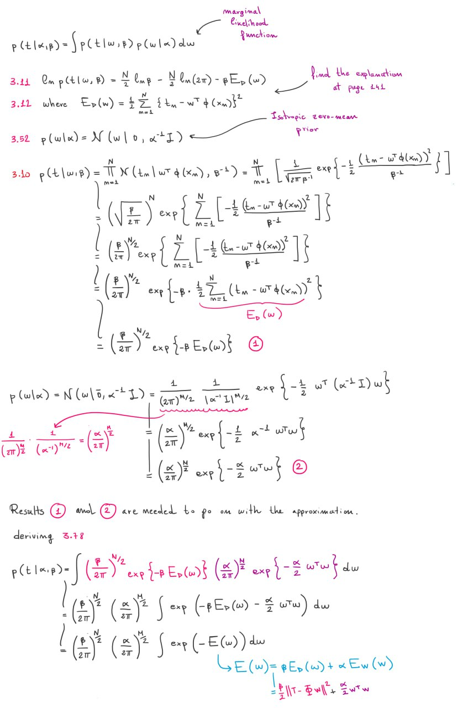
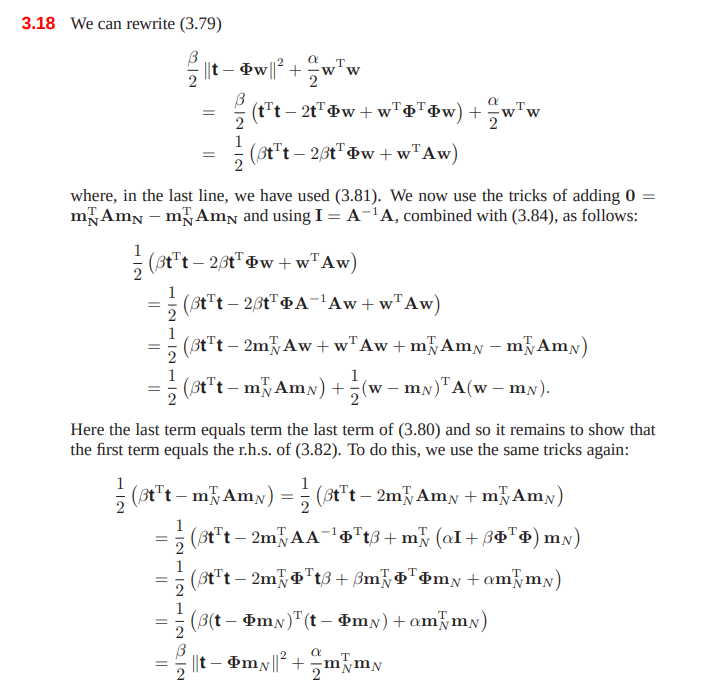

## The Evidence Approximation

Our linear regression model currently depends on the weights $w$ and on the hyperparameters $\alpha, \beta$ (see prev. paragraphs). A fully Bayesian treatment would introduce prior distribution over all the parameters and hyperparameters, and calculate the predictive distribution by marginalization. Anyway, solving the integral of the marginalization on all these parameters is analytically intractable.

If we introduce two priors over $\alpha, \beta$ (hyperpriors), then the predictive distribution is obtained by marginalizing over $w, \alpha, \beta$ as follows:

$$
p(t \mid T) \int\int\int p(t \mid w,\beta) p(w\mid T, \alpha, \beta) p(\alpha, \beta \mid T) \space dw\space d\alpha\space d\beta
$$

Where $p(t \mid w, \beta)$ is a likelihood function (given by 3.8) and $p(w \mid T, \alpha, \beta)$ is the posterior (the Gaussian with mean $m_N$ and covariance matrix $S_N$) and $p(\alpha, \beta \mid T)$ is a posterior for the hyperparameters.

An approximation, called **Empirical Bayes**, is given by:
1. Obtaining the marginal likelihood by integrating over $w$
2. Maximizing the likelihood to obtain the hyperparameters

Another approximation can be used if the posterior $p(\alpha, \beta \mid T)$ is peaked around the values $\hat \alpha, \hat \beta$. In this case we just obtain the two values, replace them in the marginalization, and we marginalize over $w$:

$$
p(t \mid T) \approx p(t \mid T, \hat \alpha, \hat \beta) = \int p(t \mid w, \hat \beta) p(w \mid T, \hat \alpha, \hat \beta) \space dw
$$

From Bayes theorem we know that:

$$
p(\alpha, \beta \mid T) \propto p(T \mid \alpha, \beta) p(\alpha, \beta)
$$

If the prior $p(\alpha, \beta)$ is relatively flat, then $\hat \alpha, \hat \beta$ can be obtained by maximizing the likelihood $p(T \mid \alpha, \beta)$ instead of the posterior $p(\alpha, \beta \mid T)$.

But how do we compute the likelihood $p(T \mid \alpha, \beta)$? Let's marginalize over $w$:

$$
\begin{split}
p(T \mid \alpha, \beta) &= \int p(T \mid w, \beta)p(w \mid \alpha) \space dw\\
\vdots \\
&= \left(\frac{\beta}{2\pi}\right)^{N/2} \left(\frac{\alpha}{2\pi}\right)^{M/2} \int \exp \{ -E(w) \} \space dw
\end{split}
$$

where

$$
\begin{split}
E(w) &= \beta E_D(w) + \alpha E_W(w) \\
&= \frac{\beta}{2} ||T - \Phi w ||^2 + \frac\alpha2 w^Tw
\end{split}
$$

If you want to know the intermediate calculation denoted by $\vdots$, read the content of this image:

After this, the book does a **little bit of magic**. It defines:

1. $A = \alpha I + \beta \Phi^T \Phi$ which is also $A=\nabla\nabla E(w)$ (hessian of $E$)
2. $E(m_N) = \frac\beta2 || T - \phi m_N ||^2 + \frac\alpha2 m_N^T m_N$
3. $m_N = \beta A^{-1} \Phi^T T$

And then derives:

$$
E(w) = E(m_N) + \frac12(w-m_N)^T A (w-m_N)
$$

The steps are depicted in the online exercises solutions provided by the author:

There is a connection between this and the posterior distribution $p(w \mid T)$ as we can see $m_N$ and $S_N^{-1} = A$.

We can now solve the integral inside the likelihood function $p(T \mid \alpha, \beta)$:

$$
\begin{split}
&\int \exp\{ -E(w) \} \space dw \\
&= \exp\{-E(m_N)\} \int \exp \left\{ -\frac12(w-m_N)^T A (w-m_N) \right\} \space dw \\
&= \exp\{-E(m_N)\} (2\pi)^{M/2} |A|^{-1/2}
\end{split}
$$

Now we can replace in the likelihood formula:

$$
\begin{split}
p(T \mid \alpha, \beta) &= \int p(T \mid w, \beta)p(w \mid \alpha) \space dw\\
&= \left(\frac{\beta}{2\pi}\right)^{N/2} \left(\frac{\alpha}{2\pi}\right)^{M/2} \int \exp \{ -E(w) \} \space dw \\
&= \left(\frac{\beta}{2\pi}\right)^{N/2} \left(\frac{\alpha}{2\pi}\right)^{M/2} \exp\{-E(m_N)\} (2\pi)^{M/2} |A|^{-1/2}
\end{split}
$$

And we can also calculate the log likelihood:

$$
\ln p(T \mid \alpha,\beta) = \frac M2 \ln \alpha + \frac N2 \ln \beta - E(m_N) - \frac 12 \ln |A| - \frac N2 \ln(2\pi)
$$

The book does an example with the polynomials as basis functions and shows how the likelihood prefers a trade-off between model accuracy and complexity, with lower values for high order polynomials. 

## Finding the hyperparameters

Now that we have obtained the likelihood expression $p(T \mid \alpha,\beta)$, we want to maximize it for $\alpha$ and $\beta$.

### Maximizing for $\alpha$

When we derive $p(T \mid \alpha, \beta)$ w.r.t. $\alpha$ we only have to look at the term $\ln |A|$ ([click for more info](https://stats.stackexchange.com/questions/395587/pattern-recognition-and-machine-learning-bishop-how-is-this-log-evidence-fun)).  The eigenvalues of matrix $A$ have the form $\alpha + \lambda_i$ with $i=1\dots  M$. The derivative is:
$$
\begin{split}
\frac{\partial}{\partial \alpha} \ln |A| &= \frac{\partial}{\partial \alpha} \ln \prod_{i=1}^M (\lambda_i + \alpha) \\
&= \frac{\partial}{\partial \alpha} \sum_{i=1}^M \ln (\lambda_i + \alpha) \\

&= \sum_{i=1}^M \frac{1}{\lambda_i+\alpha}
\end{split}
$$

