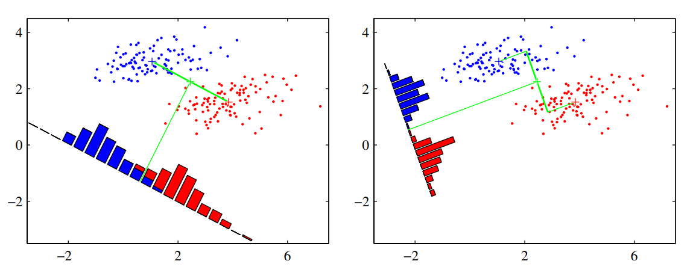

# Linear models for classifications

## 4.1.3 Least squares for classification

> ### Matrices legend.
> | Matrix      | Dimension        |
> | ----------- | ---------------- |
> | $\tilde W$  | $(D+1) \times K$ |
> | $\tilde{X}$ | $N \times (D+1)$ |
> | $T$         | $N \times K$     |

Consider a classification task with $K$ classes, let $t$ be a one-hot encoding target vector. Each class $C_k$ is described by its own linear model so that

$$
y_k(x) = w_k^T x + w_{k_0} \hspace{1cm} k=1,\dots,K
$$

By using vector notation, we can combine them together:

$$
y(x) = \tilde{W}^T \tilde{x}
$$

Where $\tilde{W}$ is a $(D+1) \times K$ matrix such that the $k$-th column is $(w_{k_0}, w_k^T)^T$ and $\tilde{x}=(1, x^T)^T$.  

Objective: to determine the parameters of $\tilde{W}$ by minimizing a sum-of-squares loss function. 

Consider a training dataset $\{ x_n, t_n \}_{n=1}^{N}$ and define two sparse matrices 
* $T$ of dimension $N \times K$ such that the $n$-th row is the binary one-hot-encoded vector $t_k$. 
* $\tilde X$ of dimension $N \times (D+1)$ such that the $n$-th row is $\tilde{x}_n^T$

The sum-of-squares loss function can be written as:

$$
E_D(\tilde{W}) = \frac12\text{Tr}\left\{
    (\tilde{X}\tilde{W} - T)^T(\tilde{X}\tilde{W} - T)
\right\}
$$

> Question: why do we use the trace?

Set the derivative of $E_D$ w.r.t. $\tilde W$ to zero and obtain the following solution:

$$
\tilde W = (\tilde X^T \tilde X)^{-1} \tilde X^T T = (\tilde X^\dagger)^T T
$$

If we want to obtain the result without using too much matrix calculus we can do the following:

$$
\begin{split}
\tilde X \tilde W &= T \\
\tilde X^T \tilde X \tilde W &= \tilde X^T T \\
(\tilde X^T \tilde X)^{-1}\tilde X^T \tilde X \tilde W &= (\tilde X^T \tilde X)^{-1} \tilde X^T T \\
\tilde W &= (\tilde X^T \tilde X)^{-1} \tilde X^T T \\
\tilde W &= \tilde X^\dagger T \\
\end{split}
$$

The discriminant function will be:

$$
y(x) = \tilde W^T \tilde x = T^T (\tilde X^\dagger)^T \tilde x  
$$

Problems with the discriminant function obtained through minimization of SSE:

* Sensible to outliers
* Bad performances since it estimates $\mathbb{E}[t \mid x]$ under assumption of Gaussian noise, which is clearly wrong when estimating a binary vector $t_n$

### An interesting property

Every target vector in the training set satisfies some linear constraint:

$$
a^T t_n + b = 0
$$

For some costants $\bar a, b$. The model prediction for any value of $x$ will satisfy the same constraint 

$$
a^T y(x) + b = 0
$$

If we use a one-hot-encoding scheme for $t_n$, then components of $y(x)$ will sum up to 1. However, this is not enough for considering $y(x)$ a probability distribution since its components are no bound to $[0,1]$. 

## 4.1.4 Fisher's linear discriminant

Suppose we have 2 classes, the idea is to project the D-dimensional input $x$ to a scalar value $y=w^Tx$ and classify $x$ as class $C_1$ if $y \ge -w_0$ and class $C_2$ otherwise. 

The problem is that projecting the input from D dimensions to 1 dimension consists on a significant loss of information, and if the classes are well separated in the high-dimensional space, they can overlap in the 1-dimensional space. However, we can optimize $w$ in order to maximize the separation between classes in the 1-dimensional space. 

One way to do this is to consider the class mean vectors:

$$
\bar m_1 = \frac1{N_1}\sum_{n \in C_1} x_n \hspace{1cm}
\bar m_2 = \frac1{N_2}\sum_{n \in C_2} x_n
$$

And maximize

$$
\hat m_2 - \hat m_1 = w^T(\bar m_1 - \bar m_2)
$$

where $\hat m_k = w^T\bar m_k$. One problem is that we can make $\hat m_k$ arbitrarly large by incrementing the magnitude of $w$. This can be solved by constraining a fixed magnitude $\sum_i w_i^2 = 1$. To enforce this constraint during optimization, we can use Lagrange multipliers. We find that $w \propto (\bar m_2 - \bar m_1)$. 

The problem with this simple approach is that it doesn't take the variance into account, and the datapoints in the 1-dimensional space may be overlapped (e.g., when their distribution has a strongly nondiagonal covariance). See the figure on the left below.

The discriminant function on the right is obtained using the **Fisher linear discriminant**, which introduce the variance in the objective to optimize.

Define the variance of class $k$ in the projected space as:

$$
s_k^2 = \sum_{n \in C_k} (y_n - \hat m_k)^2 
$$

where $y_n = w^T x_n$. The total within-class variance for the whole dataset is simply $s_1^2 + s_2^2$. The fisher criterion **to maximize** is defined as the ratio of the between-class variance to the within-class variance:

$$
J(w) = \frac{(\hat m_2 -\hat m_1)^2}{s_1^2+s_2^2}
$$

We can rewrite the Fisher criterion in the following form to make the dependence on $w$ explicit:

$$
J(w) = \frac{w^T S_B w}{w^T S_W w}
$$

Where $S_B$ is the between-class covariance matrix:

$$
S_B = (\bar m_2 - \bar m_1)(\bar m_2 - \bar m_1)^T
$$

and $S_W$ is the total within-class covariance matrix:

$$
S_W = \sum_{n \in C_1} (x_n - \bar m_1)(x_n - \bar m_1)^T + \sum_{n \in C_2} (x_n - \bar m_2)(x_n - \bar m_2)^T
$$

By differentiation, we find that $J(w)$ is maximized when

$$
(w^T S_B w) S_W w = (w^T S_W w) S_B w 
$$

Since we only care about the direction of $w$, we can drop the scalar factors $(w^T S_B w)$ and $(w^T S_W w)$. Then we multiply both sides by $S_W^{-1}$ and obtain the Fisher Linear Discriminant:

$$
w \propto S^{-1}_W (\bar m_2 - \bar m_1)
$$

If the within-class variance is isotropic, so that $S_W$ is proportional to the unit matrix, then we find that $w$ is proportional to the difference of the class means.

The projection function $y(x)=w^Tx$ is not really a discriminant, but we can construct a discriminant by choosing a threshold $y_0$ to classify the points.

### Relation to least squares

*For the two class problem, the Fisher criterion can be obtained as a special case of least squares.* 

Let $N$ be the total number of observations, $N_1$ the observations from $C_1$ class, and $N_2$ from $C_2$ class. Reparameterize the target values as:

1. $t_n = N / N_1$ if $x_n \in C_1$ 
2. $t_n = - N / N_2$ if $x_n \in C_2$  

Write the sum of squares error function:

$$
E = \frac12 \sum_{n=1}^N \bigg[ (w^T x_n + w_0)  - t_n \bigg]^2
$$

By setting $\partial E / \partial w_0 = 0$ and $\partial E / \partial w = 0$, after some algebraic manipulations, we find:

$$
w \propto S_W^{-1}(m_2 - m_1) \hspace{1cm}
w_0 = -w^T m
$$

where $w$ corresponds to the solution for the Fisher criteria, and we have also obtained an expression for the threshold $w_0$, where $m$ is the mean of all the observation. For intermediate steps, check page 210.

### Fisher discriminant for multiple classes

Suppose $K > 2$ classes. Let $x_n \in \R^D$, where $D > K$. We need to project the observation $x_n$ to $y_n \in \R^{D'}$, and we can calculate each component $y_n^{(k)}$ as follows

$$
y_n^{(k)} = w_k^T x_n
$$

Where $w_k \in R^D$. We can group $w_k$ for $k=1, \dots, D'$ as columns of a matrix $W$ of dimension $D \times D'$, and calculate the $y_n$ vector in one step as:

$$
y_n = W^T x_n
$$

Let's define the within and between class covariances for the multi-class problem. 

The within class covariance $S_W$ is:

$$
S_W = \sum_{k=1}^K S_k  \hspace{1cm}
S_k = \sum_{n \in C_k} (x_n - m_k)(x_n - m_k)^T \hspace{1cm}
m_k = \frac1{N_k}\sum_{n \in C_k} x_n
$$

The between class covariance $S_B$ is:

$$
S_B = \sum_{k=1}^K N_k(m_k - m)(m_k - m)^T \hspace{1cm}
m = \frac1N\sum_{n=1}^N x_n
$$

Now let's define the covariances but in the projected space of $y_n$.

The within class covariance $S_W$ is:

$$
s_W = \sum_{k=1}^K \sum_{n \in C_k} (y - \mu_k)(y - \mu_k)^T   \hspace{1cm}
\mu_k = \frac1{N_k}\sum_{n \in C_k} y_n
$$

The between class covariance $S_B$ is:

$$
s_B = \sum_{k=1}^K N_k(\mu_k - \mu)(\mu_k - \mu)^T \hspace{1cm}
\mu = \frac1N\sum_{n=1}^N y_n
$$

There exist different objective functions to maximize, but here we use the one from (Fukunaga, 1990), which is:

$$
J(W) = \text{Tr}(s_W^{-1}s_B)
$$

Rewriting with explicit dependence on $W$:

$$
J(W) = \text{Tr}\left( (WS_WW)^{-1}(WS_BW) \right)
$$

**Solution**: the columns of the matrix $W$ that maximizes $J(W)$ are the D' eigenvectors of the D' largest eigenvalues of the matrix $S_W^{-1}S_B$.

**Observation**: Since the matrix resulting from an outer product of non-zero vector [has always a rank of 1](https://en.wikipedia.org/wiki/Outer_product#:~:text=additional%20associativity%20property%3A-,Rank%20of%20an%20outer%20product,matrix%20is%20of%20rank%20one.), since $S_B$ is composed by the sum of $K$ rank-1 matrices and since only $K-1$ of these matrices are independent, then $S_B$ as a rank at most equal to $K-1$, and therefore there are at most $K-1$ non-zero eigenvalues. This means that we are unable to find more than $K-1$ linear features by this method (Fukunaga, 1990).

> Right now we have only reduced the dimensionality of the data. Where is the discriminant function?

## 4.1.7 Perceptron

Find my notes about Perceptron [here](https://lemuelpuglisi.github.io/DIDM.web/3_Classificazione.html#43-perceptron) (in italian).